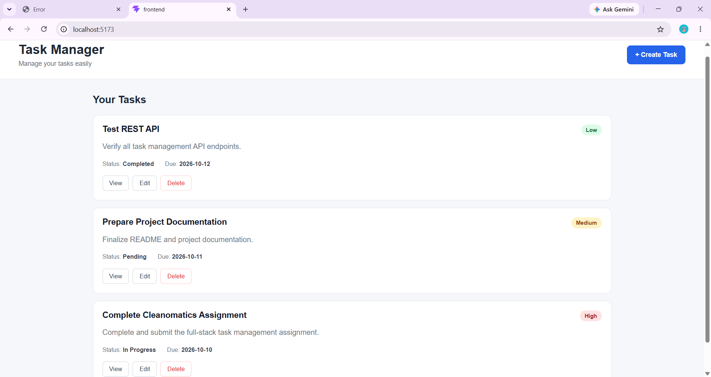
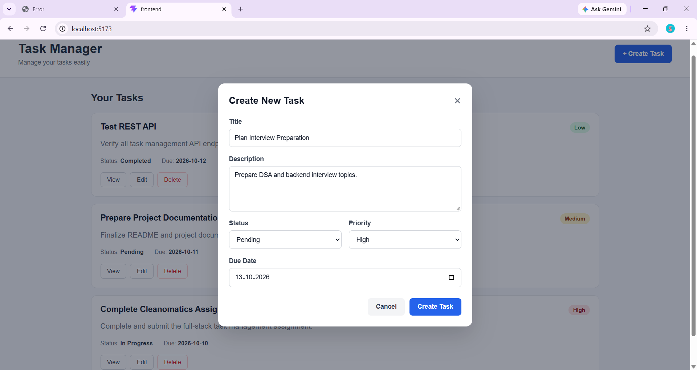
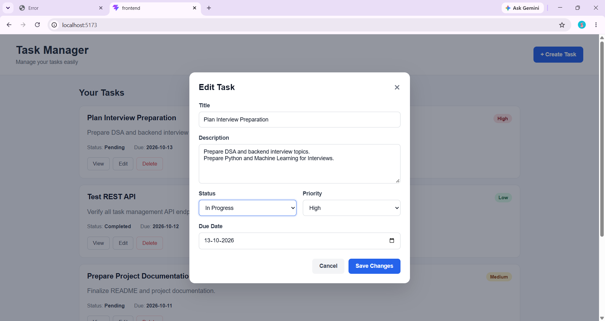
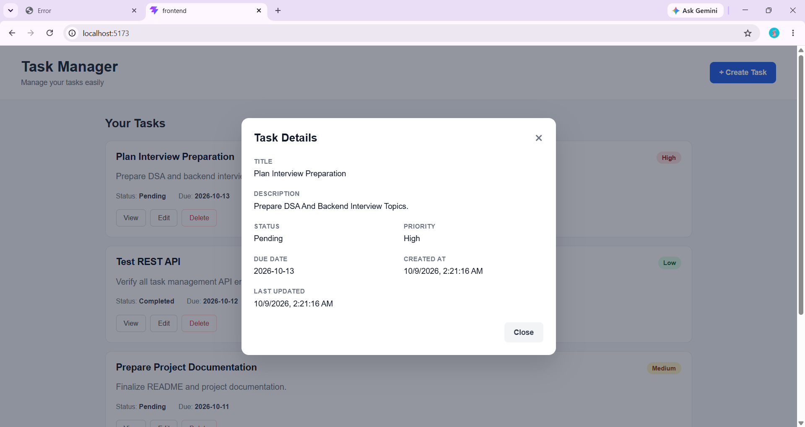
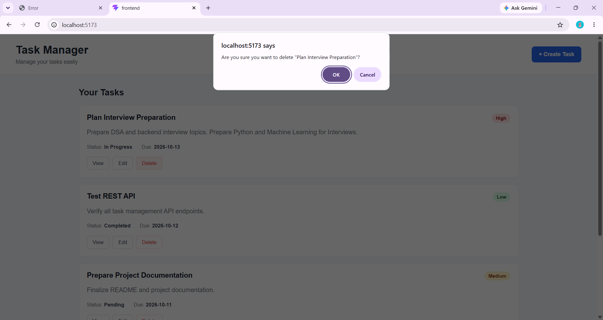
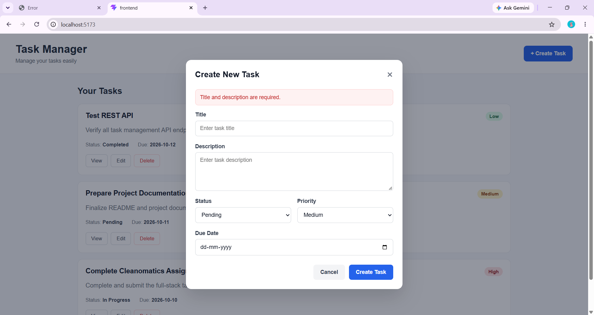
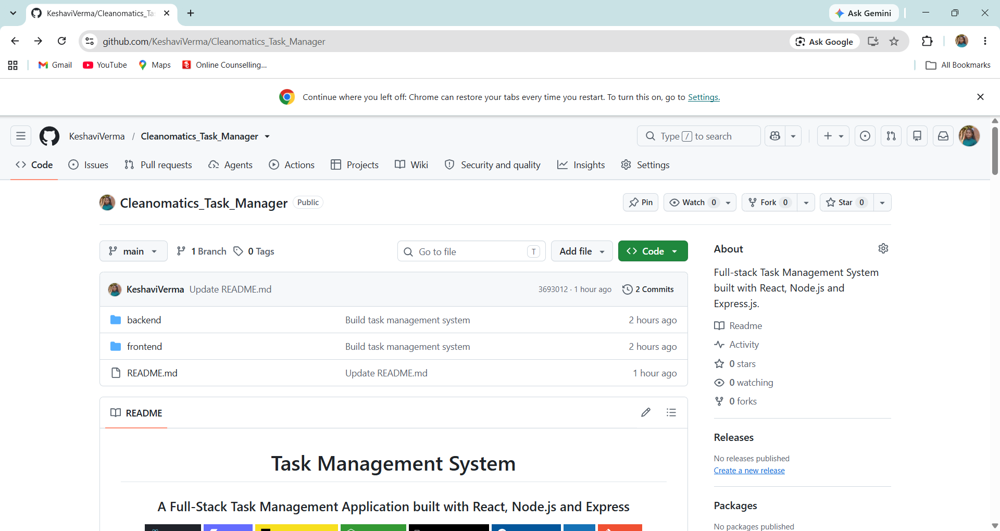

<!-- PROJECT TITLE -->

<h1 align="center">Cleanomatics Task Manager</h1>

<h3 align="center">
A Full-Stack Task Management Application to Create, Track and Organize Work Efficiently
</h3>

<p align="center">


</p>

---

## 📌 Project Overview

Cleanomatics Task Manager is a **full-stack web application** developed as part of the **Cleanomatics Full-Stack Developer Assignment**.

The application provides a simple and responsive dashboard where users can **create, view, edit and delete tasks** while keeping track of their **status, priority and due dates**.

The **frontend** is built with **React.js and Vite**, while the **backend** is built with **Node.js and Express.js**. Both communicate through a **RESTful API**.

As required by the assignment, tasks are stored in an **in-memory JavaScript array**, so no external database is needed to run the project.

---

## 🎯 Problem Statement

Managing multiple tasks without a centralized system makes it difficult to keep track of **progress, priorities, descriptions and deadlines**. Important work can be forgotten, and finished tasks pile up and clutter the list.

Users need a simple interface where they can:

- Create and organize tasks  
- Track task status  
- Assign task priorities  
- Set due dates  
- View complete task information  
- Update tasks when requirements change  
- Remove completed or unnecessary tasks  

---

## 💡 Proposed Solution

This project provides a **lightweight task management application** with a clean, responsive interface and a well-structured REST API.

The system follows a **client-server architecture**. The React frontend sends requests to the Express backend, which processes them through routes, controllers and a dedicated service layer.

The proposed solution offers several benefits:

- **Simple and intuitive dashboard** for everyday task management  
- **Complete CRUD operations** through a clean REST API  
- **Validation on both frontend and backend** for reliable data  
- **Modular architecture** that is easy to maintain and extend  

---

## 🏗️ Application Architecture

<p>
<h4 align="center">

🖥️ <b>React Frontend (Vite)</b>  
⬇️  
🌐 <b>REST API</b>  
⬇️  
⚙️ <b>Express Backend (Routes → Controllers)</b>  
⬇️  
🧠 <b>Task Service</b>  
⬇️  
📦 <b>In-Memory Storage</b>  
</h4>
</p>


| Backend Layer | Responsibility |
|---------------|----------------|
| **Routes** | Define API endpoints and map them to controller functions |
| **Controllers** | Handle HTTP requests, validate input and return responses |
| **Services** | Contain business logic and manage the in-memory task array |
| **Middleware** | Provide centralized error handling |

---

# ✨ Key Features

| Feature | Description |
|---------|-------------|
| 📝 **Task Creation** | Add tasks with title, description, status, priority and due date |
| 👁️ **Task Details** | View complete task information, including created and updated dates |
| ✏️ **Task Editing** | Update any field, with `updatedAt` refreshed automatically |
| 🗑️ **Task Deletion** | Delete tasks with a confirmation dialog to prevent accidents |
| 🔄 **Status Management** | Track progress through three status stages |
| 🚨 **Priority Management** | Mark tasks as low, medium or high priority |
| ⚠️ **Validation & Error Handling** | Frontend and backend validation with centralized error middleware |
| 📱 **Responsive UI** | Works across desktop, tablet and mobile screens |
| ⏳ **Loading & Empty States** | Clear feedback while data loads or when no tasks exist |

---

## 🧠 Task Status & Priority

| Status | Meaning |
|--------|---------|
| `pending` | Task has not been started |
| `in_progress` | Task is currently being worked on |
| `completed` | Task has been completed |

| Priority | Meaning |
|----------|---------|
| `low` | Low priority task |
| `medium` | Normal priority task |
| `high` | High priority task |

---

## 📦 Task Data Structure

```json
{
  "id": "123456789",
  "title": "Complete assignment",
  "description": "Finish the Cleanomatics assignment",
  "status": "pending",
  "priority": "high",
  "dueDate": "2026-10-10",
  "createdAt": "2026-10-08T17:30:00.000Z",
  "updatedAt": "2026-10-08T17:30:00.000Z"
}
```

---

## ⚠️ Validation & Error Handling

| Layer | What is validated |
|-------|-------------------|
| **Frontend** | Required title and description, instant feedback, API error messages |
| **Backend** | Required fields, valid status, valid priority, task existence |

| Response Code | Meaning |
|---------------|---------|
| `200` | Request successful |
| `201` | Task created successfully |
| `400` | Invalid request data |
| `404` | Task not found |

---

## 🛠️ Technologies Used

| Category | Tools / Technologies |
|----------|----------------------|
| Frontend | React.js, Vite, JavaScript, HTML5, CSS3 |
| Backend | Node.js, Express.js, CORS, dotenv |
| API | RESTful API (JSON) |
| Storage | In-memory JavaScript array |
| Tools | Git, GitHub, VS Code, Postman |

---

## 🔗 API Endpoints

| Endpoint | Method | Description | Status Codes |
|----------|--------|-------------|--------------|
| `/api/health` | GET | Health check for the API | `200` |
| `/api/tasks` | GET | Fetch all tasks | `200` |
| `/api/tasks/:id` | GET | Fetch a single task by ID | `200`, `404` |
| `/api/tasks` | POST | Create a new task | `201`, `400` |
| `/api/tasks/:id` | PUT | Update an existing task | `200`, `400`, `404` |
| `/api/tasks/:id` | DELETE | Delete a task | `200`, `404` |

**Example: Create a Task**

```http
POST /api/tasks
Content-Type: application/json
```

```json
{
  "title": "Complete assignment",
  "description": "Finish the Cleanomatics task management assignment",
  "status": "pending",
  "priority": "high",
  "dueDate": "2026-10-10"
}
```

**Response**

```json
{
  "success": true,
  "data": {
    "id": "123456789",
    "title": "Complete assignment",
    "description": "Finish the Cleanomatics task management assignment",
    "status": "pending",
    "priority": "high",
    "dueDate": "2026-10-10",
    "createdAt": "2026-10-08T17:30:00.000Z",
    "updatedAt": "2026-10-08T17:30:00.000Z"
  }
}
```

---

## 🔄 Request Flow

When a user creates a task:

<p>
<h4 align="center">

👤 <b>User fills the Create Task form</b>  
⬇️  
✅ <b>Frontend validates input</b>  
⬇️  
🌐 <b>POST /api/tasks</b>  
⬇️  
⚙️ <b>Route → Controller → Task Service</b>  
⬇️  
📦 <b>Task saved in in-memory array</b>  
⬇️  
🔄 <b>201 Created → Task list refreshes</b>  
</h4>
</p>

---

## 📂 Project Structure

```text
Cleanomatics_Task_Manager/
│
├── frontend/
│   ├── src/
│   │   ├── components/
│   │   │   ├── TaskCard.jsx
│   │   │   ├── TaskDetails.jsx
│   │   │   ├── TaskForm.jsx
│   │   │   └── EditTaskForm.jsx
│   │   ├── services/
│   │   │   └── taskApi.js
│   │   ├── App.jsx
│   │   ├── index.css
│   │   └── main.jsx
│   ├── package.json
│   └── vite.config.js
│
├── backend/
│   ├── src/
│   │   ├── routes/task.routes.js
│   │   ├── controllers/task.controller.js
│   │   ├── services/task.service.js
│   │   ├── middleware/errorHandler.js
│   │   ├── app.js
│   │   └── server.js
│   ├── .env.example
│   └── package.json
│
├── .gitignore
└── README.md
```

---

## ▶️ Running the Project

**1. Clone the repository**

```bash
git clone https://github.com/KeshaviVerma/Cleanomatics_Task_Manager.git
cd Cleanomatics_Task_Manager
```

**2. Start the backend**

```bash
cd backend
npm install
```

Create a `.env` file inside the `backend` folder:

```env
PORT=5000
```

Then run:

```bash
npm run dev
```

Backend runs at `http://localhost:5000`  
Health check: `http://localhost:5000/api/health`

**3. Start the frontend** (in a new terminal)

```bash
cd frontend
npm install
npm run dev
```

Frontend runs at `http://localhost:5173`

---

## 💾 Data Storage

This project intentionally uses **in-memory storage** as required by the assignment.

```javascript
let tasks = [];
```

- No database setup is required  
- The project is easy to run locally  
- Data exists only while the backend server is running  
- Restarting the backend resets all tasks  

---

## 📸 Screenshots

### 🖥️ Dashboard
<p align="center">
  
</p>

### ➕ Create Task & ✏️ Edit Task
<p align="center">
  
  
</p>

### 👁️ Task Details & 🗑️ Delete Confirmation
<p align="center">
  
  
</p>

<p align="center">
  
</p>
<p align="center">
  <i>Required field errors are shown when the title or description is left empty.</i>
</p>

### 🧪 GitHub
<p align="center">
  
</p>

---

## 📋 Assignment Requirements Covered

| Requirement | Status |
|-------------|--------|
| React frontend | ✅ |
| Node.js + Express backend | ✅ |
| REST API | ✅ |
| In-memory storage | ✅ |
| Create / View / Edit / Delete task | ✅ |
| Task status, priority and due date | ✅ |
| Created / updated timestamps | ✅ |
| Frontend and backend validation | ✅ |
| Error handling | ✅ |
| Loading and empty states | ✅ |
| Responsive UI | ✅ |
| Clean backend architecture | ✅ |
| Environment variables | ✅ |

---

## 🔮 Future Improvements

- Search tasks by title or description  
- Filter and sort by status, priority or due date  
- Pagination  
- Dark mode  
- Swagger API documentation  
- User authentication and authorization  
- Persistent database (MongoDB / PostgreSQL)  
- Unit and integration testing  
- Cloud deployment  

---

## 👩‍💻 Author

<p align="center">
<b>Keshavi Verma</b><br>
B.Tech Computer Science & Engineering
</p>

<p align="center">
<a href="https://github.com/KeshaviVerma">

</a>
</p>

---

<p align="center">
⭐ If you found this project helpful, please star the repository.
<br>

</p>